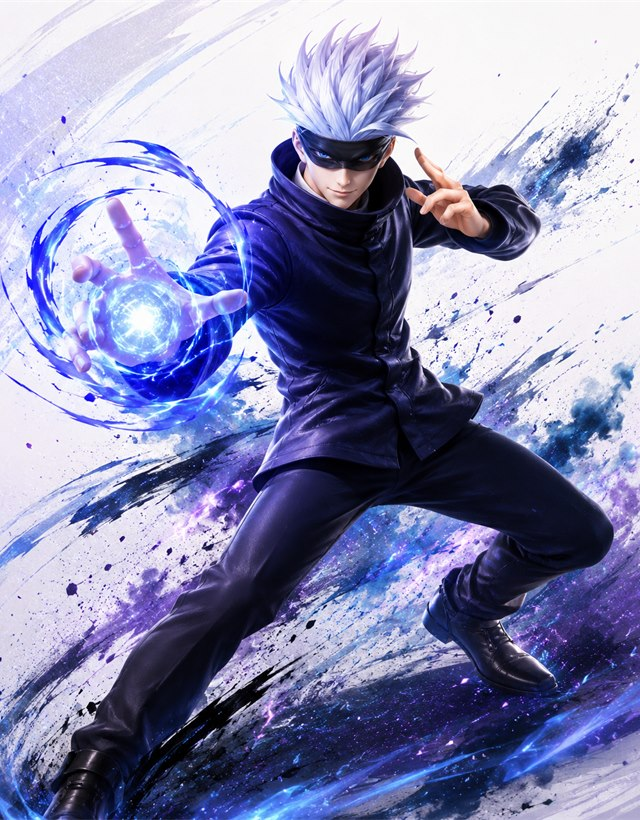

# JJK Brawler II

A browser platform fighter starring 17 characters from *Jujutsu Kaisen*, built
in the spirit of Super Smash Bros. — percent damage, stocks, blast zones,
shields and parries, dashes and dodges, light/heavy attack kits, and a unique
set of specials plus a meter-funded **ultimate** for every fighter.

This is a ground-up reimplementation of the original prototype: new engine,
new battle system, new per-frame sprite pipeline. It is fully self-contained —
no build step, no dependencies, no network access at runtime.



## Run

**Easiest — double-click a launcher** (no installs needed):

- macOS: `play-mac.command` — uses node or python3 if you have them, otherwise
  the ruby that ships with macOS.
- Windows: `play-windows.bat` — uses node or python if you have them,
  otherwise a pure-PowerShell server built into Windows.

Either one starts a local server and opens the game in your browser; close the
terminal window to stop.

> macOS may warn the first time because the script isn't notarized —
> right-click → Open, or run `xattr -d com.apple.quarantine play-mac.command`.

**Or by hand** with node:

```sh
npm start        # or: node server.mjs
```

Open <http://127.0.0.1:5174>. (The game must be served over HTTP — ES modules
don't load from `file://`.)

## Play

- **Modes:** VS CPU (Easy / Normal / Hard) or 2-player local. Gamepads
  supported (first pad = P1, second pad = P2).
- **Stocks:** 1 / 2 / 3 / 5. Twenty stages.
- The in-game **Move List** (main menu or pause) documents every character's
  full kit.

| Action | P1 | P2 | Gamepad |
|---|---|---|---|
| Move (double-tap = dash) | A / D | ◀ / ▶ | Stick / D-pad |
| Jump (tap = short hop) | W | ▲ | A |
| Crouch / fast-fall / drop | S | ▼ | Down |
| Light attack | J | , | X |
| Heavy attack (hold = charge) | K | . | Y |
| Special (+ side / down variants) | L | / | B |
| Ultimate (full meter) | I | ' | LB / RB |
| Shield · +dir = roll · +down = spot dodge · in air = air dodge | L Shift | R Shift | Triggers |
| Pause | Space / Esc | — | Start |

Backtick (`` ` ``) toggles hitbox debug view.

## Documentation

- [docs/game-mechanics.md](docs/game-mechanics.md) — the battle system:
  knockback model, movement, defense, offense, meter, statuses, stages.
- [docs/characters.md](docs/characters.md) — the research: each character's
  canon abilities and personality, and how they map to stats, specials,
  ultimates, and passives.
- [docs/audit-guide.md](docs/audit-guide.md) — how to keep hardening the game:
  headless test recipes, the audit loop, and known false positives.
- [docs/asset-pipeline.md](docs/asset-pipeline.md) — how sprites were
  individually extracted from the imprecise v1 sheets into per-frame
  alpha PNGs with a placement manifest.

## Project layout

```
index.html, styles.css      shell + menus (DOM UI)
server.mjs                  zero-dependency static server
src/
  main.js                   boot, fixed-timestep loop, match flow
  constants.js              physics & balance constants
  state.js                  shared mutable game state
  characters.js             all 17 fighter definitions (data-driven)
  moves.js                  light/heavy kit derivation
  fighter.js                movement, defense, ledges, KO state machine
  combat.js                 hit resolution, shields/parry, statuses, projectiles
  specials.js               special-move primitives + signature mechanics
  ultimates.js              17 cinematic ultimates
  ai.js                     CPU opponent (3 difficulty levels)
  render.js / sprites.js / camera.js / particles.js
  ui.js                     menus, HUD, move list
  input.js / audio.js / assets.js / stages.js / utils.js
assets/
  sprites/<char>/*.png      340 individually-extracted alpha frames + manifest
  backgrounds/ cards/ sfx/ music/
tools/
  extract_sprites.py        sheet → per-frame extraction pipeline (see docs)
docs/                       design & research documentation
```

## Credits

Fan project for local play. *Jujutsu Kaisen* and its characters are the
property of Gege Akutami / Shueisha / MAPPA. Sprite art, backgrounds, music,
and sound effects carried over from the v1 prototype assets.
