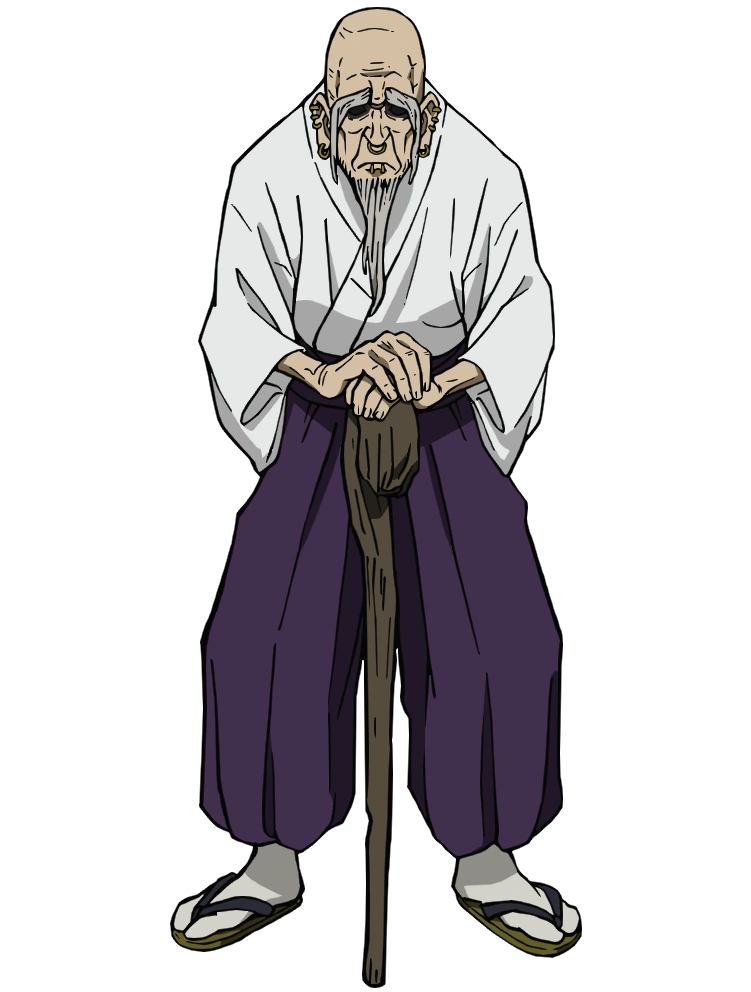
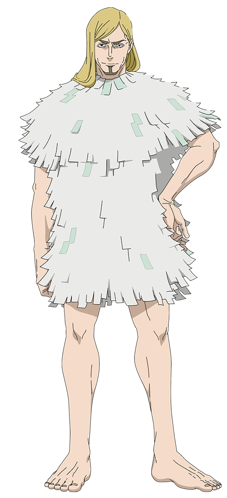
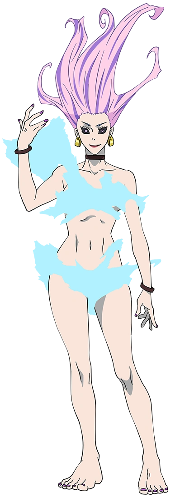

# Asset Requests — open requests

Everything in this file is **outstanding**. Delivered rounds are recorded in
[asset-requests-history.md](asset-requests-history.md) — including the round
numbers, so a commit or code comment citing "round 5 art" still resolves.

**Current status: rounds 1–8 delivered. Rounds 9 and 10 are open.**

The roster is complete: all 23 fighters have a card, 31 poses and their effect
sprites. Nothing pending blocks play — round 9 is consistency, accuracy and
polish.

---

## Where to deliver

**Upload art to `assets/intake/`, never to `assets/sprites/`.**

```
assets/intake/<character>/<pose_key>.png    sprites
assets/intake/effects/<name>.png            technique effects
assets/intake/summons/<name>.png            summon minions
assets/intake/cards/<key>_card.jpg          hero cards
assets/intake/backgrounds/<name>.jpg        stage / domain backgrounds
```

`assets/sprites/` holds **finished runtime art only** — keyed, trimmed, alpha,
registered in `manifest.json`. Generated art arrives as an untrimmed plate on a
flat colour field with no alpha, so a raw file landing there makes the game try
to draw a 1024×1536 background as a sprite. Every round so far has arrived that
way, so this is the normal case rather than a mistake — it just has to go
through the pipeline first.

`assets/intake/` is tracked by git (only `_processed/` is ignored) so uploading
into it works. Raw files live there until processed, then move to
`assets/reference/round<N>/` as the permanent archive. See
[assets/intake/README.md](../assets/intake/README.md) for the full flow.

---

## Delivery spec

PNG, **one subject per file**, no text, no watermark, no border, no grids.
(Hero cards are the exception: JPEG, full-bleed background — see 9A.)

- **Background:** a **flat key screen**, solid magenta `#FF00FF` — except
  warm-palette characters (Sukuna, Nobara, Momo, Hakari, Yuji, Choso, and now
  Uro and Gakuganji — see 9E), which need mid-grey `#808080`. A magenta key
  eats pink and red tones.

  Our generator **cannot output a true alpha channel** — every delivery is an
  opaque plate on a flat colour field, which is why the repo talks about green,
  magenta and grey screens rather than transparency. So the key screen is not a
  fallback, it is the format, and the transparency in `assets/sprites/` is
  something `tools/intake.py` cuts on import. That makes the *quality of the
  screen* the thing that decides whether a sprite comes out clean: pick a
  screen colour that appears nowhere in the character, keep it perfectly flat
  and unlit, and do not let it bounce colour onto hair or cloth edges. Round 9F
  is a whole request that exists because a screen leaked.
- **Facing:** draw everything **facing RIGHT**. If your generator prefers left,
  say so and it gets batch-mirrored on import.
- **Framing:** full body inside the frame with margin on **all four sides**.
  Nothing may touch the canvas edge.
- **Resolution:** character body **at least 600 px tall**.
- **One zoom per character.** Draw every pose of a character at the same figure
  scale — do not redraw each pose to fill its canvas. Standing poses should
  measure within a few percent of each other; low poses (crouch, roll, run) are
  genuinely shorter. This is the single most expensive thing to fix later: it is
  only catchable by eye, and a mismatch between two frames of the same idle
  makes the character visibly pulse while standing still.
- **Opacity:** bodies 100% opaque; only genuine effects (glow, mist, sound
  waves) may be translucent.

Style suffix — append to every sprite prompt:

> clean Japanese anime key-art style matching the Jujutsu Kaisen TV anime,
> crisp dark lineart, cel shading with soft gradient accents, vibrant colors,
> high detail, full body, no text

Prompt formula: `[CHARACTER BLOCK]`, `[POSE LINE]`, facing right,
`[STYLE SUFFIX]`.

### Directional effects point LEFT

The projectile renderer mirrors a sprite when it travels right, so art drawn
pointing right flies backwards with its blunt end leading. Draw travelling
effects (beams, lances, diving creatures) **pointing left**; `chain.png` and
`crow.png` are the correct references.

---

## Character blocks

Used verbatim as `[CHARACTER BLOCK]` in every prompt below, so a character's
design stays identical across their card, their sprites and any new art.

Use verbatim — these are the established designs, checked against the current
sheets.

**Check the block against the show before drawing.** The authority is the
character's **(Anime)** full-body render on
[jujutsu-kaisen.fandom.com](https://jujutsu-kaisen.fandom.com), not the block
text and not the art already in the repo. Three blocks below (`uro`, `reggie`,
`gakuganji`) described characters who look nothing like their anime designs,
which is what section **9E** exists to fix; those three rows have been
rewritten from the reference and their old wording is dead. Downloaded copies
of the references live in
[`assets/reference/canon/`](../assets/reference/canon/), with the source URLs
and a recipe for fetching more in that directory's README.

| Character | Block |
|---|---|
| gojo | "Satoru Gojo from Jujutsu Kaisen, tall slim young man with spiky white hair and a black blindfold over his eyes, wearing a black high-collared jujutsu uniform with dark trousers and black boots" |
| yuta | "Yuta Okkotsu from Jujutsu Kaisen, slim young man with messy black hair, wearing an all-white long-sleeve school uniform with white trousers, a katana at his hip" |
| hakari | "Kinji Hakari from Jujutsu Kaisen, tall young man with slicked-back blond hair and an undercut, wearing a black school jacket hanging open over his bare chest, dark trousers" |
| maki | "Maki Zen'in from Jujutsu Kaisen, athletic young woman with dark green hair in a high ponytail and rectangular glasses, navy school uniform tunic over dark leggings, carrying a long naginata polearm" |
| megumi | "Megumi Fushiguro from Jujutsu Kaisen, young man with spiky black hair, wearing a dark navy high-collared jujutsu uniform with dark trousers and brown boots" |
| nobara | "Nobara Kugisaki from Jujutsu Kaisen, young woman with short auburn-orange bob hair, navy school uniform dress with a belt, dark tights and brown boots, small hammer in hand" |
| inumaki | "Toge Inumaki from Jujutsu Kaisen, slim young man with light grey-blond hair, wearing a dark navy high-collared school uniform zipped up over his mouth, white sneakers" |
| panda | "Panda from Jujutsu Kaisen, a large anthropomorphic panda with black and white fur, muscular build, a small teal cursed-energy core visible on his shoulder" |
| todo | "Aoi Todo from Jujutsu Kaisen, very large muscular man with black hair in a short topknot and thick eyebrows, wearing a dark navy jacket over a maroon shirt with dark trousers" |
| momo | "Momo Nishimiya from Jujutsu Kaisen, petite young woman with shoulder-length auburn hair and a large dark witch hat, dark navy Kyoto uniform dress, riding or holding a wooden broom" |
| nanami | "Kento Nanami from Jujutsu Kaisen, tall blond man with a straight bob and tinted rectangular glasses, wearing a tan-beige suit with a patterned tie, carrying a blunt-tipped cleaver sword" |
| toji | "Toji Fushiguro from Jujutsu Kaisen, tall muscular man with short black hair and a vertical scar at the corner of his mouth, fitted black short-sleeve T-shirt and loose dark charcoal trousers with a dark sash" |
| sukuna | "Ryomen Sukuna the King of Curses from Jujutsu Kaisen, bare-chested muscular man with spiky salmon-pink hair, four eyes, black tattoo band markings across his face, chest and arms, dark loose trousers with a black sash" *(grey key)* |
| mahito | "Mahito from Jujutsu Kaisen, slim young man with pale blue-grey patchwork skin covered in stitched seams, long grey-blue hair in a loose bun, dark sleeveless vest and dark trousers" |
| geto | "Suguru Geto from Jujutsu Kaisen, tall man with long black hair in a topknot, wearing a black traditional robe with gold trim over dark clothing" |
| jogo | "Jogo from Jujutsu Kaisen, a volcano-headed cursed spirit with a single large eye, cracked earthen skin, wearing a yellow-and-black spotted fur mantle over dark trousers" |
| hanami | "Hanami from Jujutsu Kaisen, tall upright cursed spirit with a dark grey-brown bark body, branch spurs on the shoulders, a flower growing from its head and glowing eyes in a cracked wooden face" |
| yuji | "Yuji Itadori from Jujutsu Kaisen, athletic teenage boy with short spiky salmon-pink hair and brown eyes, wearing a dark navy high-collared jujutsu school uniform jacket over a red hoodie, matching dark trousers and white sneakers" *(grey key)* |
| choso | "Choso from Jujutsu Kaisen, pale serious young man with long black hair tied into two high loose buns with strands framing his face, a dark horizontal marking across the bridge of his nose, wearing a loose black robe-like tunic with pale trim, wide sleeves, dark trousers and simple shoes" *(grey key)* |
| meimei | "Mei Mei from Jujutsu Kaisen, tall elegant woman with very long silver-lavender hair worn in thick loose braids, calm confident expression, wearing a fitted black high-collared long-sleeved dress with gold buttons and dark tights, carrying a large single-headed battle axe" |
| uro | "Takako Uro from Jujutsu Kaisen, lean athletic woman with a fierce confident grin, pale violet-pink hair sweeping upward and outward in wild flame-like curling points, sharp violet eyes with heavy dark eyeliner, large gold cylindrical drop earrings, a black choker and a black band on each wrist, her only covering a wrap of pale-cyan cloud vapour clinging across her chest and hips with soft drifting edges, bare arms and legs, barefoot with violet-painted nails" *(grey key)* |
| reggie | "Reggie Star from Jujutsu Kaisen, tall lean man with straight shoulder-length blond hair parted at the side, heavy-lidded tired eyes and a narrow pointed chin beard, wearing a shaggy knee-length tunic and matching shoulder cape built from layered rows of torn white paper receipts with small pale mint-green printed tabs, bare arms and bare lower legs, barefoot" |
| gakuganji | "Yoshinobu Gakuganji from Jujutsu Kaisen, stern hunched elderly man, bald on top with long straight white hair falling past his shoulders at the sides, a long thin white beard and drooping moustache, deeply wrinkled face with hooded eyes and gold hoop earrings, wearing a cream-white kimono top under a black band T-shirt with the kimono sleeves hanging loose, wide dark-purple hakama trousers, white tabi socks and wooden geta sandals, a crimson-red Flying-V electric guitar slung across his chest on a strap" *(grey key)* |

*(The 17 above are the launch roster; the six below shipped in round 7. The
`uro`, `reggie` and `gakuganji` rows were rewritten from the anime reference in
round 9 — see **9E**; art made against their old wording is being replaced.)*


---

# Round 9 — open

Six independent parts; any can be delivered on its own.

- **9A** — regenerate the 17 original hero cards so the select screen is one style (17 images)
- **9B** — 10 technique frames that currently show the wrong move
- **9C** — 7 Domain Expansion backgrounds for the new domain feature
- **9D** — 4 stage-hazard props for the Active Boards update (optional polish)
- **9E** — redraw Gakuganji, Reggie and Uro from the anime reference; their current art is the wrong character (93 sprites + 3 cards)
- **9F** — redeliver Mahito's 16 generated poses on a clean key screen; the current ones carry residue from two different keys (16 sprites)

**9E is the highest-value part of this round.** 9A–9D are polish on art that is
already right; 9E replaces three fighters who are drawn as people who do not
exist in the show.

---

## 9A. Regenerate the 17 original hero cards

Round 7 delivered six new fighters, and their hero cards landed in a **visibly
different art style** from the original seventeen. All six are now live, so the
select screen shows a clear seam between the two styles. (All six round-7 fighters have since shipped, so the split is now **17 old-style
cards against 6 new-style ones**.)

This round brings the old cards up to the new style so the roster reads as one
set.

Nothing else about the cards changes: same path (`assets/cards/<key>_card.jpg`),
same **640×820** dimensions (already consistent across all 23 cards on disk —
verified), so delivery is a straight file swap with no code change.

### What actually differs

Measured by putting `gojo_card.jpg` / `sukuna_card.jpg` next to
`yuji_card.jpg` / `meimei_card.jpg`:

| | Original 17 (rounds ≤6) | Round-7 six — **the target** |
|---|---|---|
| Crop | Full body, feet visible | **Half-body to three-quarter** — cut between the waist and mid-thigh, never showing feet |
| Rendering | Glossy semi-3D figure render, airbrushed volumes | **Flat cel shading, crisp dark lineart** — TV-anime cel, not a statue render |
| Background | Abstract ink / paint-splatter on **white** | **Painted environment** — a real place with atmospheric depth and shallow depth-of-field blur |
| Lighting | Even studio light on the figure | **Directional cinematic light**, warm rim light, colored ambience |
| Framing | Wide action pose, character small in frame | Character fills the frame, face large |
| Reads as | A poster of a figurine | A still from the show |

The two levers that matter most are **half-body crop** and **environmental
background instead of white splatter**. Get those right and the set matches even
if the rendering drifts slightly.

### Framing constraint — keep the face high

The UI crops these cards three ways, always anchored to the **top** edge
(`object-position: top`):

| Where | Crop taken | As % of the 820px height |
|---|---|---|
| Hero card on the select screen | top 640×450 | **top 55%** |
| Battle HUD portrait | top 640×640 square | top 78% |
| Roster grid thumbnail | ~ full card | top ~98% |

So the **head and the readable part of the pose must sit inside the top 55%**
of the image. All four delivered round-7 cards already satisfy this — every one
puts the face in the top third — so following the style suffix gets it for
free. Anything important placed low in the frame is only ever seen in the grid
thumbnail.

### Delivery spec (cards)

- **Format:** JPEG, **640×820**, `assets/cards/<key>_card.jpg` (overwrite).
- **No text, no logo, no border, no frame, no signature** — the UI draws the
  name, and a baked border fights the card's rounded corners.
- Full-bleed background: these are the one asset type that is *not* keyed or
  transparent, so paint the scene edge to edge.
- Higher-resolution generation then downscale to 640×820 is fine and preferred.

### Style suffix — append to every card prompt

This is the consistency lever. Use it verbatim on all seventeen:

> half-body portrait cropped between the waist and mid-thigh, character turned
> slightly toward the viewer with the head high in the frame, clean Japanese
> TV-anime key-art style matching the Jujutsu Kaisen anime, crisp dark lineart,
> flat cel shading with soft gradient accents,
> painted environmental background with atmospheric depth and shallow
> depth-of-field blur, dramatic directional lighting with warm rim light,
> vibrant saturated colors, high detail, no text, no logo, no border

And explicitly **avoid** (this is what the old cards look like, so it is worth
negative-prompting): `full body, feet visible, white background, paint splatter,
ink splatter background, 3D render, glossy airbrushed rendering, figurine,
studio product shot, text, watermark, border`.

### Prompt formula

`[CHARACTER BLOCK]` + `,` + `[CARD LINE]` + `,` + `[STYLE SUFFIX]`

Character blocks are unchanged — reuse them verbatim from **Character blocks** above
(the same blocks that drove the sprite rounds), so a character's outfit stays
identical between their card and their in-game sprites.

### Card lines — 17 total

Each line is written for a half-body crop (upper-body action only) and picks a
background that matches the character's in-game theme color, so the card and
their HUD accent agree.

| File | Theme | Card line |
|---|---|---|
| `gojo_card.jpg` | `#62dcff` | "lifting his blindfold with two fingers to reveal one glowing pale-blue Six Eyes, a sphere of blue cursed energy hovering above his other palm, moonlit Tokyo rooftop backdrop" |
| `yuta_card.jpg` | `#9fc7ff` | "katana held up in a reverse grip, the vast translucent pale shape of Rika looming over his shoulder, cold blue-white school courtyard at night" |
| `hakari_card.jpg` | `#ff62cf` | "grinning with his jacket hanging open, a spinning jackpot wheel of hot pink light blazing behind his head, gaudy neon arcade interior" |
| `maki_card.jpg` | `#69d0a8` | "naginata levelled across her body, glasses catching the light, faint jade-green sheen along the blade, dim Zen'in estate corridor" |
| `megumi_card.jpg` | `#7c8cff` | "hands locked in the shikigami ritual hand sign, indigo shadow rising around him with two wolf silhouettes forming in it, moonlit shrine grounds" |
| `nobara_card.jpg` | `#d86a4a` | "hammer cocked back with a straw-doll nail pinched between her fingers, cocky smirk, warm orange dusk over a Tokyo side street" |
| `inumaki_card.jpg` | `#d7d9e7` | "tugging his high collar down to speak, faint silver rings of sound rippling outward from his mouth, pale overcast schoolyard" |
| `panda_card.jpg` | `#8ea0b8` | "arms folded with a broad confident grin, the teal cursed-energy core glowing at his shoulder, bright Kyoto exchange-event grounds" |
| `todo_card.jpg` | `#b66cff` | "hands caught mid-clap, a violet displacement ripple bursting between his palms, dust-lit stadium arena" |
| `momo_card.jpg` | `#b7b8ff` | "hovering side-saddle on her broom with her hat brim tipped low, pale lavender wind streaming past her, high above a cloud-broken sky" |
| `nanami_card.jpg` | `#ffd35a` | "loosening his tie with the blunt cleaver resting on one shoulder, tired unimpressed stare, amber office-tower windows at dusk" |
| `toji_card.jpg` | `#a8aeb8` | "the Inverted Spear of Heaven held low across him, scarred mouth curled in a lazy smile, cold grey concrete underpass" |
| `sukuna_card.jpg` | `#ff4c55` | "all four eyes open, one hand raised with fingers curled to dismantle, crimson slashes tearing through the air around him, burning ruined skyline" |
| `mahito_card.jpg` | `#b56cff` | "head tilted with a childlike smile, one patchwork stitched hand reaching toward the viewer, warping violet soul-light behind him, tiled sewer tunnel" |
| `geto_card.jpg` | `#7d58d8` | "palm open with a cursed spirit orb condensing above it, serene contemptuous expression, purple-lit temple hall" |
| `jogo_card.jpg` | `#ff7a2f` | "single eye narrowed, magma cracking and glowing along his volcanic head, embers streaming upward, scorched black earth and drifting smoke" |
| `hanami_card.jpg` | `#9bb36b` | "one bark-clad hand outstretched with a cursed flower blooming open from the palm, glowing eyes set in the cracked wooden face, sunlit deep forest" |

### Non-human notes

`panda`, `jogo` and `hanami` have no waist to crop at in the usual sense —
frame them **head-and-upper-torso** at roughly the same visual scale as the
human cards, so their heads land in the same band of the frame. Hanami in
particular is tall and thin; do not shrink the whole figure to fit, crop it.

If Hanami is regenerated, note there is an **alternate art set** for him
(`spriteSet: "alternate"`, his round-6 redesign) — the card should match the
**default** design, since the card does not swap with the sprite set.

### Suggested ordering

**Ship `gojo_card.jpg` first, alone.** He is the most-seen card and the
whitest / most abstract of the old backgrounds, so he is the clearest test of
whether the style suffix lands. Compare it against `meimei_card.jpg` (already
live in the same grid), adjust the suffix if needed, then batch the rest.

After that, work **group by group** — the select screen is now split into
labelled rows (`CHARACTER_GROUPS` in `src/config_menus.js`), so finishing a whole
group makes that row internally consistent even while others are pending:

1. **Sorcerers** — `gojo`, `nanami`, `todo`, `momo`, `hakari`, `toji`
   (this row also contains new-style `meimei` and `gakuganji`, so the mismatch
   is most visible here).
2. **Tokyo Jujutsu Students** — `yuta`, `maki`, `megumi`, `nobara`, `inumaki`,
   `panda` (this row also holds new-style `yuji`).
3. **Curses and Curse Users** — `sukuna`, `mahito`, `jogo`, `hanami`, `geto`
   (row also holds new-style `choso`). Left for last because the non-human
   designs are the biggest style stretch.

### Integration

Drop the files over the existing ones and reload — the paths and dimensions are
unchanged, so nothing in code needs touching. Worth eyeballing afterwards: the
select screen (all 23 cards in one grid), a hero card at lock-in, and the battle
HUD portrait, since those are the three different crops.

### Delivery checklist

| Card | Regenerated | Checked in grid |
|---|---|---|
| `gojo` | ☐ | ☐ |
| `yuta` | ☐ | ☐ |
| `hakari` | ☐ | ☐ |
| `maki` | ☐ | ☐ |
| `megumi` | ☐ | ☐ |
| `nobara` | ☐ | ☐ |
| `inumaki` | ☐ | ☐ |
| `panda` | ☐ | ☐ |
| `todo` | ☐ | ☐ |
| `momo` | ☐ | ☐ |
| `nanami` | ☐ | ☐ |
| `toji` | ☐ | ☐ |
| `sukuna` | ☐ | ☐ |
| `mahito` | ☐ | ☐ |
| `geto` | ☐ | ☐ |
| `jogo` | ☐ | ☐ |
| `hanami` | ☐ | ☐ |

---

## 9B. Technique frames that show the wrong move — 10 frames

Carried over from the missing-sprites audit. These are **not** missing files,
so nothing 404s and nothing appears in the console — the state resolves to a
generic cell from the original sprite sheet that does not depict the technique
being used. Verified still outstanding against `src/characters.js`.

All ten belong to the original 17, who still use `r{row}c{col}` sheet cells for
states round 5 did not cover.

| Character / state | Move it should show | Currently draws |
|---|---|---|
| `maki` / `specialNeutral` | Cursed Tool Toss | `r1c2` — her dash frame |
| `nobara` / `specialNeutral` | Straw Doll: Nail Shot | `r0c2` |
| `geto` / `specialNeutral` | Cursed Spirit Volley | `r3c2` |
| `geto` / `specialSide` | Rainbow Dragon | `r3c0` |
| `geto` / `downHeavy` | Kuchisake-Onna's Scissors | `r2c2` |
| `hakari` / `specialDown` | Reserve Balance | `r4c3` |
| `megumi` / `specialNeutral` | Nue | `r3c2` |
| `hanami` / `specialNeutral` | Cursed Buds | `r3c2` |
| `hanami` / `specialSide` | Root Eruption | `r2c2` |
| `jogo` / `specialSide` | Lava Geyser | `r2c2` |

Deliver as semantic pose keys, the same naming the round-7 fighters use, so the
frame is addressed by what it is rather than by a grid position:

| File | Pose line |
|---|---|
| `maki/special_neutral.png` | "hurling a spinning cursed tool forward underarm, weight rotated through the throw, arm following through across the body" |
| `nobara/special_neutral.png` | "firing cursed nails from a drawn-back hammer, nails streaking from the hammer head, off hand flicked open" |
| `geto/special_neutral.png` | "releasing a handful of small cursed spirits from an open palm held forward, robe sleeve falling back" |
| `geto/special_side.png` | "both arms sweeping outward to loose a huge serpentine cursed spirit low along the ground, body braced against the recoil" |
| `geto/attack_down.png` | "swinging a heavy overhead blow straight down into the ground, deep stance, robe billowing with the drop" |
| `hakari/special_down.png` | "slamming an open palm down as a pachinko reel of light spins beside him, cocky grin, jacket flaring" |
| `megumi/special_neutral.png` | "flicking a hand out low as a winged shadow shikigami launches forward from beneath him, shadow pooling at his feet" |
| `hanami/special_neutral.png` | "lobbing a cluster of seed pods underhand from a bark-clad palm, branch arm extended forward" |
| `hanami/special_side.png` | "driving one arm down into the earth to raise roots, torso twisted low, bark shoulders hunched" |
| `jogo/special_side.png` | "thrusting a hand toward the ground to erupt a magma vent, single eye narrowed, heat haze rippling off the volcanic head" |

Each needs the same **one zoom per character** treatment as everything else:
match the figure scale of that character's existing `idle_a`.

Once delivered these are wired by pointing the character's `anims` entry at the
new key (e.g. `specialNeutral: { frames: ["special_neutral"], … }`), which is a
one-line change per state.

---

## 9C. Domain Expansion backgrounds — 7 images

Domain Expansion is implemented (`src/domains.js`): seven fighters can spend a
full Cursed Energy bar to open a domain that replaces the arena for several
seconds and gives them a live interaction on SPECIAL. It plays now — these
backgrounds are the missing visual.

**How they are used.** While a domain is open the renderer dims the stage,
draws this image full-bleed behind the fighters, then grades it with the
domain's colour and adds an edge vignette (`drawDomainBackdrop` in
`src/render.js`). Fighters, platforms and effects all draw on top. Until the
file exists the stage is simply dimmed and graded, which reads acceptably — so
these load as **optional** and a missing one is not an error.

### Delivery spec (domain backgrounds)

Different from every other asset in this doc, so read this rather than assuming:

- **Format:** JPEG, **1280×720**, at `assets/backgrounds/domains/<name>.jpg`.
- **Full-bleed, no transparency** — these are environments, not sprites, so no
  keying and no alpha. Paint edge to edge.
- **No characters in frame.** The fighters are drawn over the top; a figure in
  the art would read as a second copy of somebody.
- **Keep the centre band calm.** Fighters occupy roughly the middle 60% of the
  frame vertically. Detail belongs at the top and the edges; a busy centre
  fights the sprites. Think of it as a backdrop, not a splash illustration.
- **Dark and desaturated.** The renderer already brightens and colour-grades
  these. Art delivered at full brightness comes out washed and swallows the
  fighters — aim for something that looks slightly too dark on its own.
- **No text, no logo, no border, no UI.**

Style suffix — append to every domain prompt:

> dark atmospheric anime background illustration in the style of the Jujutsu
> Kaisen TV anime, painted environment, dramatic perspective, deep shadows,
> muted desaturated palette with one dominant accent colour, cinematic depth,
> no characters, no text

### The seven domains

| File | Fighter | Accent | Prompt |
|---|---|---|---|
| `unlimited_void.jpg` | Gojo | violet-white | "an infinite white void filled with countless floating streams of information, endless overlapping translucent glyphs and diagrams receding to infinity, a single vast dark sphere hanging at the centre of an otherwise featureless plane, cold violet-white light" |
| `malevolent_shrine.jpg` | Sukuna | crimson | "a colossal shrine of bleached skulls and bone beams standing in an open scorched courtyard with no walls around it, tattered ritual banners, ash drifting through red light, the ground scored with countless deep slash marks" |
| `shadow_garden.jpg` | Megumi | indigo | "a still black ocean of liquid shadow stretching to the horizon under a starless indigo sky, the surface mirror-smooth and reflecting nothing, faint silhouettes of animal shapes moving beneath it" |
| `self_embodiment.jpg` | Mahito | violet-grey | "a vast dark chamber whose walls, floor and ceiling are made entirely of enormous pale human hands pressed together in a woven lattice, fingers interlocking into a floral pattern, sickly violet light between them" |
| `iron_mountain.jpg` | Jogo | orange-red | "the sealed interior of an erupting volcano, sheer black basalt walls rising on every side, rivers of magma running down them into a molten floor, superheated orange haze and drifting embers" |
| `idle_death_gamble.jpg` | Hakari | hot pink | "the interior of a lavish Japanese pachinko parlour at full blaze, endless rows of machines with spinning reels, chrome and mirrored ceiling, a storm of hot pink and gold neon, confetti in the air" |
| `mutual_love.jpg` | Yuta | pale blue-white | "a cold cathedral-like space of pale blue light, an immense ring of interlocking translucent shapes overhead like a halo, drifting white petals, the floor a still reflective plane" |

### Checking them in game

Pick the fighter, build a full Cursed Energy bar, press **D-pad ▲** (keyboard:
**U** for P1). A full bar buys either the ultimate or the domain, so it has to
be full before the domain input will do anything.

| File | Delivered | Checked in game |
|---|---|---|
| `unlimited_void` | ☐ | ☐ |
| `malevolent_shrine` | ☐ | ☐ |
| `shadow_garden` | ☐ | ☐ |
| `self_embodiment` | ☐ | ☐ |
| `iron_mountain` | ☐ | ☐ |
| `idle_death_gamble` | ☐ | ☐ |
| `mutual_love` | ☐ | ☐ |

### Not requested yet

The wiki lists three more roster fighters as domain users: **Hanami**, **Uro**
and **Yuji**. Their domains are either unnamed in canon or arrive very late in
the series, so they have no kit here yet and no background is requested. If you
want them, say so and they can be designed like the other seven.

---

## 9D. Stage-hazard props — 4 sprites (optional polish)

The Active Boards update (`src/stage_fx.js`) gives every stage a gameplay
gimmick. All of the hazard visuals are drawn procedurally on canvas, so
**nothing is blocked and nothing looks broken without these** — each file, when
it lands, simply replaces its procedural stand-in. They load as optional
`stagefx:*` keys (see `STAGE_FX_SPRITES` in `src/assets.js`); a missing file is
not an error.

Deliver like every other effect sprite: PNG on a flat magenta key screen, one
subject per file, margin on all sides, to `assets/intake/effects/`.

| File | Used on | Prompt |
|---|---|---|
| `stage_lantern.png` | Lantern Corridor (falls and starts a small fire) | "a traditional Japanese paper lantern with a red-orange body and dark wooden ribs, glowing warmly from within, hanging from a short cord, drawn straight on" |
| `stage_fang.png` | Curse Maw / Cursed Teeth (snapping and falling fangs) | "a single huge curved monster fang of pale bone-white ivory with a faint teal cursed-energy glow at its root, point facing UP, slight wet sheen" |
| `stage_flower.png` | Garden Steps (healing bloom pickup) | "a small blooming flower with soft pink petals and a golden centre on a short green stem with two leaves, gentle white-green glow around the petals" |
| `stage_weak_curse.png` | School Wing (wandering weak cursed spirit) | "a small pudgy one-eyed cursed spirit blob, dark violet mottled skin, single large yellow eye, tiny stubby arms, hunched creeping posture, faint purple aura, facing LEFT" |

Append the standard style suffix from the top of this doc to each prompt.
Sizing: these render 44–72 px tall in game, so ~400 px source height is plenty;
`stage_fang` is drawn point-up when it erupts and rotated point-down when it
falls, so draw it point-up. `stage_weak_curse` faces left like other mobile
art (it is mirrored when walking right).

| File | Delivered | Checked in game |
|---|---|---|
| `stage_lantern` | ☐ | ☐ |
| `stage_fang` | ☐ | ☐ |
| `stage_flower` | ☐ | ☐ |
| `stage_weak_curse` | ☐ | ☐ |

---

## 9E. Redraw Gakuganji, Reggie and Uro from the anime reference — 93 sprites + 3 cards

Round 7 built these three from written character blocks alone, without checking
the blocks against the show. All three blocks were wrong, so all three fighters
shipped as **the wrong character** — not stylistically off, but a different
person wearing different clothes. Nothing about their kits, hitboxes, audio or
effect sprites changes; this is purely their 31 poses and their hero card.

Put the reference beside the current art and the gap is immediate:

| | Currently in game | Anime reference |
|---|---|---|
| **Gakuganji** | all-black kimono, waist-length grey beard, generic black electric guitar | cream-white kimono under a black band tee, **purple hakama**, geta sandals, long white side-hair, gold hoop earrings, **crimson-red Flying-V** guitar |
| **Reggie** | black fur-collared bomber jacket, gold-patterned shirt, black hair, purple umbrella | **blond** shoulder-length hair, shaggy tunic and cape made of **layered torn white receipts**, bare arms and legs, **barefoot** |
| **Uro** | short black bob, white-and-purple combat bodysuit, bandaged forearms | **pale violet-pink hair flared upward in wild flame-like points**, gold cylinder earrings, black choker and wristbands, **pale-cyan cloud-form garment**, barefoot |

### The reference art

Every prompt in this section is drawn against the **(Anime)** full-body render
from [jujutsu-kaisen.fandom.com](https://jujutsu-kaisen.fandom.com). Local
copies are committed at [`assets/reference/canon/`](../assets/reference/canon/)
so this doc keeps working if the wiki reorganises; the README there records the
source URL of each and how to fetch others.

| Character | Primary reference | Secondary | Wiki URL |
|---|---|---|---|
| Gakuganji | [`gakuganji_anime.png`](../assets/reference/canon/gakuganji_anime.png) | [`gakuganji_guitar_anime.png`](../assets/reference/canon/gakuganji_guitar_anime.png) — the guitar, the band tee and the sleeves-off robe | [Yoshinobu Gakuganji (Anime).png](https://static.wikia.nocookie.net/jujutsu-kaisen/images/3/3c/Yoshinobu_Gakuganji_%28Anime%29.png/revision/latest?cb=20201025154546) |
| Reggie | [`reggie_anime.png`](../assets/reference/canon/reggie_anime.png) | [`reggie_intro_anime.png`](../assets/reference/canon/reggie_intro_anime.png) — the receipt tunic in motion | [Reggie Star (Anime).png](https://static.wikia.nocookie.net/jujutsu-kaisen/images/0/01/Reggie_Star_%28Anime%29.png/revision/latest?cb=20260403035700) |
| Uro | [`uro_anime.png`](../assets/reference/canon/uro_anime.png) | [`uro_face_anime.png`](../assets/reference/canon/uro_face_anime.png) — hair colour, eyes, earrings | [Takako Uro (Anime).png](https://static.wikia.nocookie.net/jujutsu-kaisen/images/8/84/Takako_Uro_%28Anime%29.png/revision/latest?cb=20260324045602) |

<table>
<tr>
<td align="center"><br><b>Gakuganji</b></td>
<td align="center"><br><b>Reggie Star</b></td>
<td align="center"><br><b>Uro</b></td>
</tr>
</table>

If your generator accepts an image, **feed it the primary reference** and use
the character block as the text half. If it does not, the block alone is
written to be sufficient — but read the reference yourself before approving a
frame, because the failure mode this round is fixing is exactly "the text
sounded plausible and nobody looked".

### Design notes

**Follow the reference.** No deliberate deviations this round — where a design
looks unusual, that is the design, and "tidying" it is how these three ended up
wrong in the first place.

- **Gakuganji.** The reference render shows him hunched over a walking cane in
  civilian repose; that is his default portrait, not his fighting design. Draw
  him **upright and without the cane** — the guitar is the prop. Take the
  outfit and the face from the full-body render, and take the guitar, the strap
  and the pulled-down kimono sleeves from the technique still. The guitar is a
  **crimson-red Flying V**, not a black superstrat.
- **Reggie.** The receipt tunic is not fabric: it is dozens of overlapping
  **torn paper slips** in horizontal rows, off-white with occasional pale mint
  printed tabs, ragged along every hem. It should read as paper in motion — the
  edges lift and flutter on every fast pose. He is barefoot and his lower legs
  are bare; do not add trousers or shoes.
- **Uro.** Her clothing *is* the cloud-form: pale-cyan vapour clinging across
  the chest and hips with soft, torn, drifting edges, over otherwise bare skin
  — she wears no fabric, no bodysuit and no shoes. Draw it as in the reference,
  with the vapour opaque enough to read as covering at sprite size and its
  edges moving with the pose. The hair is the other half of her silhouette:
  pale violet-pink, sweeping *upward and outward* in wild curling points, wider
  than her shoulders, and it holds that shape in every frame including the
  crouches and the roll — it does not fall flat. Earrings, choker, wristbands,
  eye makeup and nail colour all follow the reference.

### Delivery spec

The general **Delivery spec** at the top of this doc applies unchanged — facing
right, full body with margin on all four sides, body at least 600 px tall, one
zoom per character, standard style suffix. Two additions specific to these
three:

- **Key colour.** `uro` and `gakuganji` move to mid-grey `#808080`; a magenta
  key eats Uro's pink hair and Gakuganji's red guitar and purple hakama.
  `reggie` stays on magenta `#FF00FF` (his palette is white, blond and mint —
  nothing magenta-adjacent). Uro is the harder key of the three: her cloud-form
  is pale and soft-edged and her hair is a mass of fine points, so keep the
  grey flat and make sure no grey light spills into either.
- **One zoom per character, again.** Uro is the character this rule was written
  for: her round-7 `idle_b` came back ~15% larger than `idle_a`, and since idle
  alternates between them at 2.2 fps she visibly pulsed while standing still.
  Draw all 31 at one figure scale.

Deliver to `assets/intake/<key>/<pose_key>.png` as usual. The existing files
stay in place until the replacements are imported, so a partial delivery leaves
the game playable with a mix of old and new frames — ugly but not broken.

### The 31 poses

Same keys and the same pose lines as round 7, which is what the rest of the
roster uses. Reproduced here so this section stands alone.

#### Tier 1 — on screen constantly

| Pose key | Pose line |
|---|---|
| `idle_a` | "standing at rest in a relaxed combat-ready stance, weight settled, arms loose at the sides" |
| `idle_b` | "standing at rest, a subtle breathing shift — shoulders slightly raised, weight on the other foot, arms loose" |
| `run_a` | "sprinting hard, front leg driving forward, opposite arm swung back, body leaning into the run" |
| `run_b` | "sprinting hard at the opposite stride, rear leg extended behind, other arm forward, hair and clothing trailing" |
| `jump_rise` | "leaping upward, legs tucked, arms raised for balance, clothing pulled down by the rush of air" |
| `fall` | "descending through the air, legs reaching down toward a landing, arms out for balance" |
| `hurt` | "recoiling from a heavy blow, head snapped back, torso arched, arms flung loose, feet leaving the ground" |
| `guard` | "braced defensively behind a raised guard, both forearms up in front of the face and chest, knees bent, leaning into an incoming hit" |

#### Tier 2 — core actions

| Pose key | Pose line |
|---|---|
| `attack_light_a` | "throwing a fast forward jab or quick weapon strike, front arm extended, body squared" |
| `attack_light_b` | "following through on a second fast strike, torso rotated, rear arm now extended" |
| `attack_heavy` | "committing to a heavy full-body strike, deep stance, weapon or fist driven forward with full weight behind it" |
| `attack_up` | "striking sharply upward at a steep angle, one arm or weapon thrust up overhead, torso arched back, gaze following the strike skyward" |
| `attack_down` | "slamming a wide low strike into the ground, deep straddle stance, arms or weapon sweeping at ankle height to both sides" |
| `attack_air` | "attacking in midair, body angled forward off the ground, one arm or weapon swung across in a committed aerial strike, legs trailing" |
| `charge` | "gathering power in a braced crouch, fists or weapon drawn back, body coiled and tense, cursed energy beginning to gather" |
| `dizzy` | "stunned and reeling with guard broken, standing unsteadily, head lolling, arms hanging limp, knees buckling" |
| `victory` | "a confident victory pose after winning, in character — relaxed and triumphant" |
| `ledge_hang` | "hanging one-handed from a ledge, body dangling, other arm reaching up, legs hanging straight down" |

#### Tier 3 — movement detail

| Pose key | Pose line |
|---|---|
| `dash` | "bursting into a low forward dash, body almost horizontal, trailing motion" |
| `land` | "landing from a jump, knees deeply bent absorbing the impact, arms forward for balance" |
| `crouch_a` | "crouching low in a guarded stance, one knee near the ground, ready to spring" |
| `crouch_b` | "crouching low, a subtle shift — weight rocked slightly forward, arms adjusted" |
| `crouch_attack_a` | "attacking from a low crouch, arm or weapon sweeping forward near the ground" |
| `crouch_attack_b` | "finishing the low sweep, torso rotated, strike fully extended along the ground" |
| `dodge_roll` | "mid combat-roll, body tucked into a tight ball, shoulder toward the ground, clothing wrapped with motion" |
| `dodge_air` | "twisting sideways in midair to evade, body corkscrewed, arms pulled in, motion-blurred edges" |

#### Technique poses — 5 each

Draw the **pose only**. Projectiles, sound waves, clouds and cars are separate
effect sprites the engine layers on top — all of those already exist and are
**not** being redelivered — so keep any baked-in energy small and attached to
the body.

**`gakuganji`** — the guitar is the crimson Flying V in every one of these.

| Pose key | Pose line |
|---|---|
| `special_neutral` | "striking a hard downstroke on the electric guitar, strings visibly vibrating, small ripples of energy bursting from the strings" |
| `special_side` | "slamming a flat palm onto the guitar strings in a hard mute, arm rigid, kimono sleeves snapping forward" |
| `special_down` | "stepping onto an effects pedal, leaning back into a high bending solo note, beard and hakama whipped upward" |
| `ult_a` | "full shredding stance with the guitar raised high, fingers blurred on the fretboard, energy radiating outward" |
| `ult_b` | "windmill strum at the climax of the performance, arm fully extended from the swing, head thrown back" |

**`reggie`** — the umbrella-katana and the aerosol can are canon purchases and
stay; only his clothes and hair were wrong.

| Pose key | Pose line |
|---|---|
| `special_neutral` | "slashing forward with a katana drawn from an umbrella sheath, the empty umbrella shell in his off hand, receipt papers fluttering around him" |
| `special_side` | "spraying a large aerosol can forward at arm's length, head turned away with a smug grimace" |
| `special_down` | "tearing a long paper receipt in half above his head with a showman's grin" |
| `ult_a` | "arms spread wide presenting upward like a game-show host, long receipts spiraling around him" |
| `ult_b` | "pointing skyward with a triumphant grin, body angled back, the paper hems of his tunic swept by wind from above" |

**`uro`**

| Pose key | Pose line |
|---|---|
| `special_neutral` | "palm pressed flat against the empty air in front of her as if against glass, the air visibly denting around her hand" |
| `special_side` | "diving forward through the air like a swimmer off a block, arms swept back along her sides, body streamlined" |
| `special_down` | "guarded stance with both hands raised open before her, holding a curved lens of faintly distorted air" |
| `ult_a` | "both arms raised overhead, fingers clawed as if gripping the sky itself, face fierce, body stretched tall" |
| `ult_b` | "arms slammed down and across her body, torso twisted through the motion, hair whipping" |

### Hero cards — 3

Their round-7 cards are drawn from the same wrong blocks, so a sprite-only
delivery would leave each fighter's card showing a different person from their
in-game sprite. Same spec as the existing cards: **JPEG, 640×820**, at
`assets/cards/<key>_card.jpg`, no text or border, head high in the frame (the
UI crops to the top 55%). Use the **9A card style suffix** — these three
already match the round-7 look 9A is chasing, so keeping them in that style is
the point.

| File | Card line |
|---|---|
| `gakuganji_card.jpg` | "mid power-chord on the crimson Flying-V, kimono sleeves and long white hair whipped by sound pressure, stern face lit from below by amber stage light, a wall of amplifier cabinets behind him" |
| `reggie_card.jpg` | "fanning a handful of long receipts like a card sharp, umbrella-katana over one shoulder, the torn paper of his tunic lifting in the draft, neon-lit night street backdrop" |
| `uro_card.jpg` | "one palm pressed against a visible ripple in the air, sharp confident grin, pink hair flared upward, endless open sky and clouds bending behind her" |

### Integration

Standard intake, with one wrinkle worth knowing before you start: these three
already have manifest entries, so **anchor `idle_a` first and let the rest
inherit it**. Current idle `bodyH` values to match are `uro` 285, `reggie` 291,
`gakuganji` 283 — inside the roster band of 282–299, so the new art should land
at the same figure size and nothing else needs retuning.

```sh
python3 tools/intake.py                     # check the delivery
python3 tools/intake_sheets.py              # contact sheets for review
python3 tools/intake_import.py --approve    # import + manifest update
python3 tools/audit_frames.py               # confirm nothing regressed
```

Then eyeball each fighter in the workbench (`workbench/?char=uro`) and take one
round in game. Watch the idle specifically — a zoom mismatch between `idle_a`
and `idle_b` only shows as a pulse in motion.

### Delivery checklist

| Character | 31 poses | Card | Imported | Checked in game |
|---|---|---|---|---|
| `gakuganji` | ☐ | ☐ | ☐ | ☐ |
| `reggie` | ☐ | ☐ | ☐ | ☐ |
| `uro` | ☐ | ☐ | ☐ | ☐ |

---

## 9F. Mahito — clean-key redelivery, 16 poses

Mahito's design is right and his art is good; the **alpha in the runtime files
is dirty**, and it is dirty because the key screen it was cut from was dirty.
The generator hands us an opaque plate on a flat colour field and
`tools/intake.py` cuts the transparency, so anything the screen leaks onto the
art becomes fringe the moment it is keyed. On his set the screen leaked badly.

### What is actually wrong

Composite `assets/sprites/mahito/guard.png` over black and look at the hair:
the narrow gaps between hair strands are filled with green and magenta speckle
instead of being cut out, and the same residue rims the crown of the head and
the edge of the face. It is invisible against a pale stage and obvious against
a dark one, which is why it survived review.

Measured across his 36 files: **15,739 magenta-fringe pixels and 9,966
green-fringe pixels**. Green is the round-5 legacy key, magenta the later one —
his set carries both. (The count is a colour heuristic — on a character who
genuinely wears pink or purple it flags real art, which is why the roster-wide
version of this number is not meaningful. Mahito's palette is grey-blue, black
and pale skin, so for him every one of these pixels is residue.) The worst
offenders:

| Frame | Magenta px | Green px | Note |
|---|---|---|---|
| `charge.png` | 4,462 | 409 | the heaviest magenta residue of his 36 files |
| `dodge_roll.png` | 2,504 | 0 | also **fully hard-edged** — binary alpha, no anti-aliasing at all, so the silhouette is visibly jagged |
| `dodge_air.png` | 2,491 | 0 | same hard-edge problem |
| `attack_up.png` | 102 | 1,667 | green trapped through the hair |
| `run_b.png` | 86 | 1,638 | green trapped through the hair |
| `hurt.png` | 541 | 1,316 | both keys at once |

### What to deliver

The **16 generated poses** — `idle_a`, `idle_b`, `run_a`, `run_b`,
`jump_rise`, `fall`, `hurt`, `guard`, `attack_air`, `attack_up`, `charge`,
`dizzy`, `ledge_hang`, `victory`, `dodge_roll`, `dodge_air` — redelivered on a
clean key screen. Same character block, same poses, same figure scale (idle
`bodyH` 283); this is a keying fix, not a redesign, so **matching the existing
frames is the goal** — the new plates should look like the current ones with
the screen behaving itself.

Since the generator cannot give us transparency, "clean" is entirely a property
of the plate:

- **One screen, and the right one: mid-grey `#808080`.** His palette is
  grey-blue, black and pale skin. Do not use green — green is what round 5 used
  and it is still sitting in his hair — and do not use magenta, which smears
  into his blue-greys. His current set carries residue from *both*, so these
  frames have been keyed at least twice; deliver each one keyed once, on grey.
- **Flat and unlit.** The screen must be a single exact value across the whole
  canvas: no gradient, no vignette, no light bouncing off it onto him. Screen
  light spilling into hair and cloth edges is what makes a fringe impossible to
  cut cleanly later.
- **Nothing translucent against the screen.** Wherever the background shows
  through the figure — between hair strands, under an arm, inside the gap of a
  bent knee — it must be the pure screen value, not a blend of screen and hair.
  Those blended gap pixels are exactly what survives as speckle.
- **Soft edges, but only from the art.** Keep the outline anti-aliased against
  the screen — that is what gives the final sprite its feathered edge.
  `dodge_roll` and `dodge_air` currently have hard 0/255 alpha and visibly
  jagged silhouettes, which is the other failure to avoid.
- **No key colour inside the figure.** No grey matching the screen value
  anywhere on him; if a design element genuinely needs that grey, shift it a few
  values so the key cannot eat it.

His other 20 files are `r{row}c{col}` cells from the original sprite sheet and
are **not** part of this request — they are low-resolution legacy frames with a
different problem, and replacing them is a separate job.

### If regenerating is not worth it

The repo can partly repair this in place, and it is worth trying first:

```sh
python3 tools/clean_frames.py --chars mahito --defringe --report   # dry run
python3 tools/clean_frames.py --chars mahito --defringe
```

It repaints fringe pixels from the nearest clean neighbour, **colour only** —
alpha is untouched. Three limits, all of which matter here:

- it only recognises **green** residue (`fringe_mask` in `clean_frames.py`
  tests `g > r` and `g > b`), so it does nothing about the ~15.7k magenta
  pixels, which are the larger half of the problem;
- it fixes the *colour* of the speckle but not the *silhouette* — the trapped
  pixels stay opaque, so hair gaps end up filled with hair colour rather than
  cut open;
- it cannot restore anti-aliasing, so `dodge_roll` and `dodge_air` stay jagged.

Good enough to stop the rainbow; not good enough to call the frames correct.
Run it as a stopgap, then redeliver properly.

| Frame | Redelivered | Alpha verified | Checked in game |
|---|---|---|---|
| `idle_a` | ☐ | ☐ | ☐ |
| `idle_b` | ☐ | ☐ | ☐ |
| `run_a` | ☐ | ☐ | ☐ |
| `run_b` | ☐ | ☐ | ☐ |
| `jump_rise` | ☐ | ☐ | ☐ |
| `fall` | ☐ | ☐ | ☐ |
| `hurt` | ☐ | ☐ | ☐ |
| `guard` | ☐ | ☐ | ☐ |
| `attack_air` | ☐ | ☐ | ☐ |
| `attack_up` | ☐ | ☐ | ☐ |
| `charge` | ☐ | ☐ | ☐ |
| `dizzy` | ☐ | ☐ | ☐ |
| `ledge_hang` | ☐ | ☐ | ☐ |
| `victory` | ☐ | ☐ | ☐ |
| `dodge_roll` | ☐ | ☐ | ☐ |
| `dodge_air` | ☐ | ☐ | ☐ |

Verify a delivery the same way the numbers above were produced — composite each
frame over black and over green and look at the hair, then confirm no
off-palette pixels survive:

```sh
python3 - <<'PY'
from PIL import Image; import numpy as np
POSES = ["idle_a", "idle_b", "run_a", "run_b", "jump_rise", "fall", "hurt",
         "guard", "attack_air", "attack_up", "charge", "dizzy", "ledge_hang",
         "victory", "dodge_roll", "dodge_air"]
for k in POSES:
    a = np.asarray(Image.open(f"assets/sprites/mahito/{k}.png").convert("RGBA")).astype(int)
    r, g, b, al = a[..., 0], a[..., 1], a[..., 2], a[..., 3]
    vis = al > 0
    mag = ((r > 110) & (b > 110) & (g < r - 50) & (g < b - 50) & vis).sum()
    grn = ((g > 110) & (g > r + 45) & (g > b + 45) & vis).sum()
    soft = ((al > 0) & (al < 250)).sum()
    print(f"{k:14s} magenta={mag:6d} green={grn:6d} softEdge={soft:7d}")
PY
```

Both fringe counts should be **0**, and `softEdge` should be non-zero on every
frame — a zero there means the alpha is binary and the edges are jagged.

---

## 9G. Mahoraga — a full sprite set, 31 poses

Megumi's ultimate currently *summons* Mahoraga: a single static PNG
(`assets/sprites/summons/mahoraga.png`) walks across the stage as a separate
entity while Megumi stands beside it. The plan is for the ultimate to **turn
Megumi into him** instead — the player wears the shikigami for the duration
rather than watching one.

The code for that is already in the repo and switched off
(`src/config_transform.js`, `enabled: false`), gated on this art existing. It
checks every pose below is registered in `manifest.json` before it will run, so
a partial delivery cannot leave a fighter invisible mid-match — it just keeps
summoning until the set is complete.

### What to deliver

**31 poses**, the same semantic set every round-7-onward fighter uses, into:

```
assets/intake/mahoraga/<pose_key>.png
```

| | Poses |
|---|---|
| **Stance** | `idle_a`, `idle_b`, `victory`, `dizzy` |
| **Movement** | `run_a`, `run_b`, `dash`, `jump_rise`, `fall`, `land`, `dodge_roll`, `dodge_air` |
| **Crouch** | `crouch_a`, `crouch_b`, `crouch_attack_a`, `crouch_attack_b` |
| **Defence** | `guard`, `hurt`, `ledge_hang` |
| **Attacks** | `attack_light_a`, `attack_light_b`, `attack_heavy`, `attack_up`, `attack_down`, `attack_air` |
| **Techniques** | `charge`, `special_neutral`, `special_side`, `special_down`, `ult_a`, `ult_b` |

All 31 are required — the readiness check demands the full set.

### Character block

Use verbatim as the character half of every prompt:

> **Mahoraga**, the Eight-Handled Sword Divergent Sila Divine General: a towering
> humanoid shikigami with **grey-white skin over heavy muscle**, wearing loose
> dark hakama-style trousers bound at the waist, bare-chested and barefoot.
> **Six eyes in two vertical rows of three** down each side of a narrow bone-pale
> face, a wide fanged mouth, and a **long dark mane of coarse hair** falling
> behind the shoulders. Two thick **curved horns sweep back from the temples**.
> The signature detail: a **large eight-spoked wooden dharma wheel floating
> upright above and slightly behind the head**, its spokes carved with sutra
> characters, turning slowly and glowing faint white — it is never attached to
> the body and never absent. Bandage-like wrappings on the forearms; long clawed
> fingers. Presence is ancient, patient and inevitable rather than frenzied.

Style suffix as always: *clean Japanese anime key-art style matching the Jujutsu
Kaisen TV anime, crisp dark lineart, cel shading with soft gradient accents,
vibrant colors, high detail, full body, no text.*

### Design notes

- **The wheel is the character.** Every one of the 31 poses shows it. It floats
  independently of the body, so it stays upright and roughly level with the head
  no matter what the body is doing — it does not tilt with a dive or a roll.
  Keep it fully inside the frame; a clipped wheel reads as a mistake.
- **Scale.** He is drawn as the biggest thing in the game and the engine draws
  him at roughly 1.6× a fighter (`SPRITE_ACTORS.mahoraga` in characters.js).
  Draw the **body** at the same plate size the roster uses — body height around
  **290 px inside a ~1024×1536 plate**, matching Megumi's `bodyH` of 295 — and
  let the engine do the enlarging. Do not pre-scale him; a delivery drawn twice
  as large just loses resolution when it comes back down.
- **Silhouette over detail.** He is on screen for eight seconds at speed. Horns,
  mane, wheel and a heavy shouldered stance should be readable at 200 px tall.
- **He does not use cursed energy effects.** No auras, no glow around the hands,
  no coloured trails: his techniques are physical, plus the wheel. The one
  exception is `ult_a` / `ult_b`, where a **white cross-shaped slash** may show.
- **Adaptation is not shown.** Do not draw the barbed-wire adaptation growths on
  any pose — that is a later story beat and it would date the set.

### Pose prompts

Combine the character block with each line below.

| Pose | Pose line |
|---|---|
| `idle_a` | standing tall at rest, weight even, arms loose at the sides, head level, wheel turning slowly behind the head |
| `idle_b` | the same stance a breath later, chest expanded, mane and wheel shifted slightly — reads as breathing, not as a new pose |
| `run_a` | running forward, opposite arm and leg extended, mane streaming back, heavy footfall |
| `run_b` | the opposite stride of `run_a`, other leg forward, low centre of gravity |
| `dash` | lunging low and fast, body angled forward past the leading foot, one hand near the ground |
| `jump_rise` | driving upward, knees tucking, arms rising, wheel trailing just below the head |
| `fall` | descending, legs reaching for ground, arms out for balance |
| `land` | absorbing the landing, deep knee bend, one fist to the floor, dust at the feet |
| `dodge_roll` | mid evasive forward roll, body tucked, shoulder leading, wheel level and unmoved above the tuck |
| `dodge_air` | airborne mid-dodge, body curled and turned away, arms tucked, drifting sideways |
| `crouch_a` | crouched low on both feet, forearms across the knees, head slightly lowered |
| `crouch_b` | the crouch a fraction lower, weight settling, ready to spring |
| `crouch_attack_a` | sweeping a clawed hand along the floor from the crouch |
| `crouch_attack_b` | the follow-through of that sweep, arm fully across the body |
| `guard` | braced side-on, both forearms raised and crossed to take a hit, feet planted |
| `hurt` | knocked back, head snapped aside, one arm flung out, body twisting away |
| `ledge_hang` | hanging one-handed from a ledge above, body straight, other arm reaching up |
| `attack_light_a` | fast straight claw jab, lead arm extended, body square |
| `attack_light_b` | the return strike with the other hand, hips rotated through it |
| `attack_heavy` | full-power overhand hammer blow coming down, both hands together, whole body behind it |
| `attack_up` | uppercut driving straight up, chin lifted, wheel spinning faster above |
| `attack_down` | slamming both fists into the ground beneath him, shockwave dust |
| `attack_air` | mid-air downward diagonal claw slash, body extended |
| `charge` | gathering himself, fists clenched at the sides, head lowered, wheel accelerating — visibly winding up |
| `special_neutral` | a wide horizontal claw rake in front of him, both hands, arms crossing outward |
| `special_side` | charging shoulder-first as a battering ram, one arm drawn back |
| `special_down` | driving a fist through the floor from a knee, ground cracking outward |
| `ult_a` | arm drawn fully back with a white cross-shaped light forming at the wheel |
| `ult_b` | the release: a single enormous cross-slash cutting the air ahead of him |
| `dizzy` | staggered and off balance, arms hanging, head lolling, wheel wobbling out of true |
| `victory` | standing over the fallen, one fist lowered, head raised, wheel bright and steady |

### When it is delivered

1. Import with `tools/intake.py` as usual, which registers the 31 poses under a
   `mahoraga` section in `manifest.json`.
2. Flip `enabled: true` in `src/config_transform.js`.
3. That is the whole switch-over — `transformReady()` in `src/ultimates.js`
   verifies the set and Megumi's ultimate becomes the transformation.

The old summon path stays in the code and keeps working; it is what runs
whenever the transform is off or the set is incomplete.

Sprites can be reviewed before then: Mahoraga is already selectable in the
[sprite workbench](../workbench/), which shows the 31 poses as pending and
fills them in as they arrive.

---

# Round 10 — open

## 10A. Retire the sheet cells — 256 sprites across the 17 original fighters

The 17 original fighters still run mostly on their **4×5 sprite sheets**. Each
has 16 semantic poses delivered by later rounds and **20 grid cells** named
`r{row}c{col}` — 225 of which the game still draws.

The problem is not the naming. It is that **one cell has to serve several
actions at once**, and the actions differ per fighter:

| Cell | What it serves |
|---|---|
| `maki/r1c2` | dash **and** dodge **and** the second half of her jab **and** her neutral special |
| `gojo/r1c2` | dash **and** dodge |
| `megumi/r1c2` | dash **and** dodge **and** her down special |
| `r4c0` (all 17) | crouch **and** land |
| `r3c0` | 12 different combinations across the roster — side heavy, side special, neutral special, ultimate, in various pairs |

So a sprint pose is what plays when Maki throws a punch, and a crouch is what
plays when anyone lands. Every one of those actions looks wrong, and no amount
of re-pointing fixes it because there is no fourth sprite to point at. The
round-7 fighters (Yuji, Choso, Meimei, Uro, Reggie, Gakuganji) do not have this
problem: they were generated **one pose per action**, 31 files each, and they
read correctly because of it.

This round finishes that transition for the other 17.

### What to deliver

**15 new poses per fighter × 17 fighters = 255 sprites, plus one redraw of
`nobara/dodge_air` — 256 in all.** The 16 poses they already have are correct
and stay as they are. What is missing everywhere:

| | Poses to draw |
|---|---|
| **Attacks** | `attack_light_a`, `attack_light_b`, `attack_heavy`, `attack_down` |
| **Techniques** | `special_neutral`, `special_side`, `special_down`, `ult_a`, `ult_b` |
| **Crouch** | `crouch_a`, `crouch_b`, `crouch_attack_a`, `crouch_attack_b` |
| **Movement** | `dash`, `land` |

Already delivered, do not redraw: `idle_a`, `idle_b`, `run_a`, `run_b`,
`jump_rise`, `fall`, `hurt`, `guard`, `ledge_hang`, `dizzy`, `victory`,
`charge`, `attack_air`, `attack_up`, `dodge_roll`, `dodge_air`.

**One exception: `nobara/dodge_air`.** It is on that list but it is flagged
**Replace** in the workbench, so draw it again for Nobara only. Everyone else's
`dodge_air` stands.

### The flagged cells this round retires

Eleven cells carry a workbench flag saying the art itself is wrong. None of them
needs a separate commission — each is a pose already in the table above, and
drawing that pose retires the flag. They are called out here so the ones that
matter get a second look rather than being drawn on autopilot.

| Cell | Flag | Drives | Retired by | Watch for |
|---|---|---|---|---|
| `nobara/r2c2` | Fix alpha | down heavy | `attack_down` | Two defects, one redraw. An 853 px patch of the original background is still opaque between her sleeve, thigh and shoe (`docs/sprite-fixes/nobara-r2c2-alpha.png`), and the pose is a crouched hand-plant standing in for a *down heavy*. Draw her striking downward at the ground in front, weight dropping onto it — and key the background out. |
| `nobara/r3c2` | Replace | down special, ultimate | `special_down`, `ult_a` | One cell doing two jobs. The round gives each its own sprite. |
| `nobara/r3c3` | Replace | ultimate | `ult_b` | Pairs with `ult_a` as the release. |
| `nobara/dodge_air` | Replace | air dodge | `dodge_air` | The exception noted above — the only pose here outside the 15. |
| `gojo/r3c0`, `gojo/r3c1`, `gojo/r4c3`, `nobara/r2c0`, `nobara/r3c0`, `nobara/r4c2`, `nobara/r4c3` | Fix crop | see 10B | `special_side`, `ult_a`/`ult_b`, `crouch_attack_a`, `attack_heavy` | All seven are cut through by the frame edge. Measurements and a marked-up sheet are in 10B; the only instruction they add is to keep the figure fully inside the plate. |

Delivery path as always:

```
assets/intake/<character>/<pose_key>.png
```

### Consistency is the point of this round

These 256 sprites are going to sit beside 16 existing ones per fighter, so
**matching the delivered set matters more than any individual frame looking
good.** For each fighter, put their `idle_a` beside what you are drawing and
check:

- **Same costume, same proportions, same age.** The sheets and the round-3/4/5
  additions already disagree in places; this round should agree with the
  *semantic* files, which are the newer and better art.
- **Same figure scale.** Body height ~290 px on a ~1024×1536 plate, matching
  their existing `idle_a`. The engine solves the final scale per fighter from
  `heightCm`, so do not compensate.
- **Same line weight and shading.** One character's set should look like it was
  drawn in one sitting.
- **Facing right**, one subject per file, flat key screen — the standard
  delivery spec at the top of this file. Warm-palette fighters (Sukuna, Nobara,
  Momo, Hakari) key on mid-grey `#808080`, everyone else on magenta `#FF00FF`.

### Pose lines

Combine each fighter's character block with the line below. Where a pose is a
technique, the fighter's own kit decides what it looks like — the special names
are in `src/characters.js` and on the move list in game.

| Pose | Pose line |
|---|---|
| `attack_light_a` | fast opening jab or short slash, lead hand, body square, minimal wind-up |
| `attack_light_b` | the follow-up strike with the other hand, hips rotated through it — reads as the second half of a two-hit combo |
| `attack_heavy` | committed heavy blow, full body weight behind it, wide arc |
| `attack_down` | striking downward at the ground in front, weight dropping onto it |
| `special_neutral` | performing their **neutral special** — the named technique, mid-execution, with its cursed energy forming but not yet released |
| `special_side` | their **side special**, moving forward into it |
| `special_down` | their **down special**, weight low, technique breaking out of the ground or the body |
| `ult_a` | the wind-up of their **ultimate**: gathering, energy at maximum, before release |
| `ult_b` | the release of that ultimate, arms and body fully committed |
| `crouch_a` | crouched low, guard up, alert — not resting |
| `crouch_b` | the same crouch a fraction lower, weight settled |
| `crouch_attack_a` | attacking from the crouch, low sweep or upward strike from the knees |
| `crouch_attack_b` | the follow-through of that low attack |
| `dash` | sprinting flat out, body angled forward past the leading foot — a running pose, distinct from `run_a`/`run_b` which are the mid-stride cycle |
| `land` | absorbing a landing, knees bent, one hand near the floor, dust at the feet — distinct from a crouch, which holds |

### The unused cells stay

Each fighter has 5–8 grid cells nothing draws (115 across the roster). **Do not
delete them.** They are alternate poses the sheets happened to contain, and the
sprite workbench can now point any action at any sprite — so an unused cell is a
candidate for a secondary action rather than dead weight. They stay in the
manifest and stay visible in the workbench under "All sprites".

### Integrating

1. Import with `tools/intake.py`, which registers the new poses.
2. Point each fighter's kit at them: the animation tables in `src/characters.js`
   currently name grid cells, and this is what replaces those names. The
   round-7 fighters' tables are the model — they inherit `SEMANTIC_ANIMS`
   wholesale and override almost nothing.
3. Anything not re-pointed keeps working: an action still naming a grid cell
   draws the grid cell exactly as it does today, so this can land fighter by
   fighter rather than all at once.

The result is 23 fighters with one sprite per action and no shared cells, which
is what makes the roster read consistently — and it retires the `r{row}c{col}`
vocabulary from everything except the leftovers.

## 10B. Seven cells the extraction cut through

Seven cells are flagged **Fix crop** in the workbench, and all seven turn out to
be the same defect: opaque art sitting on the image border, because the cell was
extracted with the figure already touching the edge of its cell. There is no
edit that recovers them — the pixels were never committed, and the source sheets
are not in the repo or its history — so they are listed here rather than fixed.

Contact sheet: `docs/sprite-fixes/crop-flagged-diagnosis.png`.

| Cell | Drives | Clipped run (L/R/T/B px) | What is missing |
|---|---|---|---|
| `gojo/r3c0` | side special | 3 / 3 / **29** / **14** | hair sliced flat on top, boot soles cut |
| `gojo/r3c1` | ultimate | 4 / **12** / **28** / 7 | hair sliced flat on top, cursed-energy arc cut at the right |
| `gojo/r4c3` | crouch attack | **21** / 3 / 1 / **19** | rear hand cut off at the left, boot cut at the bottom |
| `nobara/r2c0` | side heavy | 4 / 3 / **14** / 4 | the hammer head, cut off above the frame |
| `nobara/r3c0` | side special | 5 / **17** / **59** / 9 | hair and the slash arc, cut at the top and right |
| `nobara/r4c2` | crouch attack | **16** / 4 / **14** / **24** | lead hand cut off at the left, shoe cut at the bottom |
| `nobara/r4c3` | crouch attack | **74** / 5 / 13 / **17** | a 74 px column of coat cut off at the left |

Every one of these already falls inside 10A: they drive `special_side`, `ult`
and `crouch_attack`, which 10A redraws for all 17 fighters. So there is nothing
extra to commission — just draw those poses with the figure fully inside the
plate and a margin around it, and these seven retire with the rest of the cells.

The lesson generalises: **all 344 sheet cells have hard binary alpha and every
one of them touches its own border.** The flagged seven are the cases where the
cut lands somewhere the eye catches it. A delivered pose should never have an
opaque pixel on the image edge.
