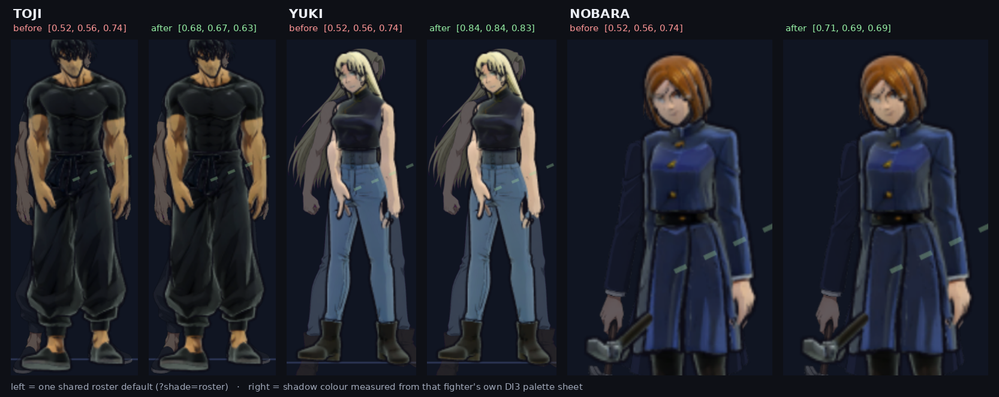

# render3d Image Requests — the 2D images the 3D pipeline needs

The `?render=3d` track consumes 2D images at two points: as **inputs to
model generation** (Tripo-style image-to-3D is a named sourcing route in
[plan.md §5](plan.md)) and as **texture ingredients** the anime pass reads at
runtime. Those are 2D deliverables, so this file follows the 2D art rules
([docs/asset-requests.md](../../docs/asset-requests.md)): everything here is
outstanding, and the rounds are lettered **DI1, DI2…** so they never collide
with the sprite rounds (numbers), the billboard rounds (B) or the model
rounds (D).

## Delivered

**DI2, DI3 and DI4 are complete for the whole roster**, and DI1 is 8 of 20
short. Yuji's set arrived first, with the 2D round-18 batch; the rest came in
one delivery of 101 images, imported by
`python3 tools/import_render3d_images.py`.

| Round | State | Landed at |
|---|---|---|
| DI1 | **12 outstanding** — see below | `render3d/docs/reference/<char>_turnaround.png` |
| DI2 | **complete, 28 of 28** | `render3d/docs/reference/<char>_face.png` |
| DI3 | **complete, 28 of 28** | `render3d/docs/reference/<char>_shade.png` |
| DI4 | **complete** — the shared 128×128 catchlight, plus a 1024×256 four-cell mouth strip for every fighter | `render3d/assets/textures/` |

**D1 is unblocked** and D3/D4 have their face and palette references for every
fighter they will name.

**DI3 has been spent.** `tools/derive_toon_from_shade.py` reads each sheet's
lit/shadow swatch pairs and writes the ratio into that fighter's `shadeTint` in
`render3d/assets/manifest.json` — the toon pass multiplies, so `shadow / lit` is
exactly the number it wants. All 27 rigs are graded from their own art where
they used to share one roster default that was cooler and darker than most of
the roster paints.



`?shade=roster` puts every fighter back on the default, which is how that
picture was taken and the reason the switch exists. One caveat worth knowing:
each rig is a SINGLE material, so there is one tint per character even though
the sheets carry five regions. The extractor weights the regions by how bright
their lit fill is — skin and hair decide what shading reads as, and a black coat
shades black whatever the tint says. Per-region tints need per-region materials,
which no delivered rig has.

### DI1: twelve boards were refused, and the round closed anyway

Twelve of the twenty arrived with **the top of the head running off the canvas**
— in Mei Mei's case the cut falls below the eyes. A turnaround is the seed a
model is generated FROM, so a board with no crown generates a mesh with no
crown, on the one feature [plan §9](plan.md) says fails first.

They were not landed. The request list is derived from which files EXIST, so a
bad board that is present reads as a round complete — the refusal is what keeps
those twelve visible as outstanding. The delivered plates are kept at
`assets/reference/round21/di1_cropped/` for comparison against the redraws.

Refused: `dagon`, `gakuganji`, `gojo`, `hakari`, `mechamaru`, `meimei`, `momo`,
`nanami`, `nobara`, `reggie`, `yuki`, `yuta`.

**Those twelve are no longer owed.** Rigs for the whole roster landed while this
was being sorted out, and a turnaround board's only job is to be the thing a
model is generated FROM — once the model exists, the board has no work left to
do. So DI1 reads as closed rather than as twelve outstanding, which is the right
answer for a slightly uncomfortable reason: the round was overtaken, not
completed. If a rig is ever rebuilt from scratch, this is the round to reopen,
and the refused plates are kept for exactly that.

Accepted: `choso`, `inumaki`, `kurourushi`, `mahoraga`, `panda`, `sukuna`,
`todo`, `toji`. (Todo's topknot and Toji's spear tip grazed the edge; the check
measures how WIDE the ink on the top edge is, because a head is wide and a
blade tip is not, and a face nobody lost is not a failure.)

**The framing rule this cost is now stated in DI1's brief below**, where it
should have been from the start: the whole figure inside the canvas, with
margin, in every view.

**To DRAW from, use [docs/image-requests.md](../../docs/image-requests.md), not
this file.** That is the single image-request document for every render mode,
generated by `node tools/build_image_requests.mjs`: the rounds below are
reproduced in it whole, resolved against the rig manifest and the files on disk,
so it knows that a fighter whose model has already arrived no longer needs a
turnaround board (DI1's only job is to be the thing a model is generated from)
but does still need the face sheet review reads against and the shade palette
their materials are graded from — not one delivered rig carries a `toon` block
today.

**This file stays the place these rounds are AUTHORED.** Edit a round here and
re-run the generator. What it must not grow is a second list of who owes what:
image requests lived in two documents once, each mode's readers saw their own
and missed the rest, and 172 images went unnoticed for it.

Deliver to the standard 2D intake unless a row says otherwise:

```
assets/intake/render3d/<char>_turnaround.png     DI1 boards
assets/intake/render3d/<char>_face.png           DI2 face sheets
assets/intake/render3d/<char>_shade.png          DI3 shade palettes
assets/intake/render3d/eye_highlight.png         DI4 shared face textures
assets/intake/render3d/<char>_mouth_sheet.png    DI4 per-fighter (optional)
```

Every request keys off the same canonical appearance reference the sprite
rounds use: `assets/reference/canon/<char>_idle.png`. Where a board must
also match in-game reads, the sprite set at `sprites/assets/<char>/` is the
storyboard.

---

## Round DI1 — model-generation turnaround boards (the Tripo inputs)

One board per fighter being modelled in the current D-round, sized for
image-to-3D seeding: **a single 2048×1024+ PNG, clean white or transparent
background**, containing the fighter in a neutral standing pose from
**front, 3/4-front, side, and back** at consistent scale and eye-line, flat
colors from the canon palette, **no dramatic lighting, no perspective, no
overlapping limbs** (arms slightly away from the body — near-A-pose reads
best for reconstruction). Face visible and on-model in the front view; the
back view must answer every question the sprites never had to (hair back,
uniform back, prop stowage).

A first-draft board can be composited from existing art:
`python tools/build_model_reference.py <char>` assembles the canon reference
plus the fighter's key sprites into a labelled board at
`render3d/docs/reference/<char>_board.png`. That composite is a brief for a
human or a seed for generation — **the request here is for the drawn
turnaround**, because sprites only ever show the one ¾ view and mirror the
rest, which is exactly what a 3D model cannot be built from.

**THE WHOLE FIGURE MUST FIT, WITH MARGIN.** Every view complete inside the
canvas — the crown of the head, any horns, hair or headgear, and the feet — with
clear white on all four sides. Twelve of the first twenty boards were refused
for exactly this: the figures were scaled to fill the frame and the tops of
their heads went off it, which on a model-generation seed is the one thing that
cannot be worked around. A smaller figure with air around it beats a large one
that is cut. `tools/import_render3d_images.py` measures this at import and
refuses a board whose head runs off the edge.

**Deliverable: 1 board per fighter.** Twelve are outstanding — the list is in
the refusal note above, and in
[docs/image-requests.md](../../docs/image-requests.md), which resolves it
against what is on disk.

## Round DI2 — face sheets (the face-first gate's reference)

AI-generated meshes fail at faces first (plan §9), and the workbench's
sweeping-light check needs something to judge AGAINST. Per fighter: one
sheet, front + ¾ + profile of the **head only**, at least 512px per view,
canon palette, neutral expression — the drawn truth of the jawline, the eye
shapes, the hair clumping and parting side. Hair clump direction matters:
the modeller combs the normals along it (D-spec addition 3).

**Deliverable: 1 sheet per fighter, same gating as DI1.**

## Round DI3 — shade palette swatches

The two-band ramp paints shadows from a palette, not from darkness
(render3d/src/toon.js `shadeTint`, overridable per material). Per fighter:
one small swatch sheet pairing each major material region (skin, hair,
uniform top, uniform bottom, props) with its **lit fill and its painted
shadow color**, taken from or consistent with the fighter's own sprite
shading. This is a color decision, not a texture: the numbers land in the
.glb's material extras (or the manifest's `toon` block) at intake, and the
sheet is what review holds them against.

**Deliverable: 1 swatch sheet per fighter, same gating as DI1. Format free —
a labelled PNG grid is fine.**

## Round DI4 — shared face textures *(one-time, roster-wide)*

The eyes-and-face rules (plan §4) run on small shared textures rather than
per-fighter art:

- `eye_highlight.png` — the camera-facing catchlight sprite: soft-edged
  white/near-white shapes on transparency, 128×128, one primary highlight +
  one small secondary. One texture serves the roster; per-fighter tinting is
  engine-side.
- `<char>_mouth_sheet.png` *(optional, per fighter, unblocking)* — a 4-cell
  strip (idle / hurt / ult-shout / win-grin) matching the fighter's face
  sheet style, 256×256 per cell, for the mouth texture-swap regions the
  D-spec lists in extras. No fighter ships blocked on this; the neutral
  modelled mouth is the default.

**Deliverable: 1 shared highlight texture now; mouth sheets ride whichever
D-round their fighter ships in.**

---

## Not requested here, on purpose

- **Stage light references** — the stage light rig derives everything from
  the stage `tint` already in src/stages.js; no new images.
- **Contact shadows** — rendered from the model's own pose when that dial
  ships; no sprite.
- **Toon ramp textures** — the two-band ramp is analytic (toon.js), not a
  lookup texture; there is nothing to draw.
- **Smear shapes** — geometry authored inside clips (D5), not images.
